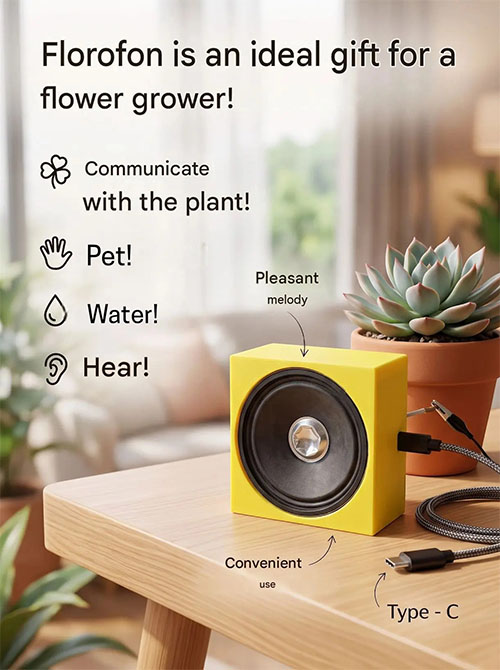

# Floraphone

Этот прибор измеряет импульсы вашего растения и преобразует его в сигнал для динамика.

Тон будет выше, если сигнал растения будет сильнее (когда вы его гладите пальцем или поливаете).

Ссылка на Ютуб  - как он работает https://www.youtube.com/shorts/LononKuzHt8

Он состоит из динамика 8 ом 2 ватта, резистора 100 ом (чтоб не сгорел микроконтроллер от малого сопротивления динамика!!!), щупа прицепленного к входу A0, батареи, и конечно же микроконтроллера Arduino nano.

схема:

Кстати, динамик должен быть размером ровно 6,5*6,5 см, иначе не вместится в корпус!!!

Корпус вы можете распечатать на принтере, с 3д моделью xbox2.gcode (лежит в папке!)

Ещё вы можете всё делать по электронной инструкции instruction.txt , там всё написано.

УДАЧИ В СБОРКЕ!!!
